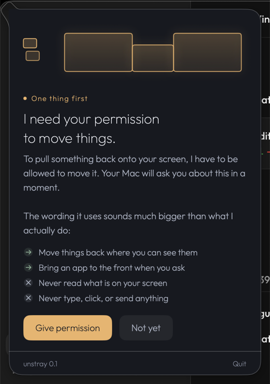

# unstray

A small Mac app that notices when your Mac has hidden a window from you, brings
it back, and tells you what happened in plain words.

It sits in the bar at the top of your screen and stays out of the way until it's
needed.



**[Download unstray 0.1](https://github.com/initiator1/unstray/releases/latest)** ·
free · macOS 14 or later

---

## Does this happen to you?

You click an app in the Dock. The menu bar changes, so it clearly heard you. No
window appears. You click again. Still nothing.

Or you make a video full screen and your other monitors go black.

Or you unplug a monitor, and something you had open is just gone.

None of that is you doing something wrong. Your Mac has a handful of ways to lose
a window, and it tells you about exactly none of them.

## What unstray does about it

**It answers one question.** Open it and it tells you whether anything's wrong
right now. If nothing is, it says so in a sentence. If something is, it shows you
the one thing that matters most, with one button.

**It finds windows you can't see** — parked off the edge of every screen, usually
after a monitor gets unplugged — and brings them back to the screen you're using.

**It notices when you click an app and nothing comes up**, and asks the app to
show you something. Usually you never find out there was a problem.

**Press ⌥⌘R** any time you're fighting with an app, and it'll gather that app onto
the screen you're looking at.

**It explains, every time.** Never "window off-screen at -12000,12485". Instead:
*"Notes is open, but you cannot see it. You had another screen plugged in at some
point…"*

Every word in the app is written for someone who doesn't know what a "Space" is,
and shouldn't have to.

## What it can't do

Being straight about this, because a tool like this is easy to oversell.

- **A frozen app can't be revived from outside.** If an app has stopped
  responding, nothing unstray does will wake it. It'll tell you that's what
  happened, so you're not left clicking a dead icon.
- **Some apps ignore being asked to open a window.** When that happens, unstray
  says so rather than pretending it worked.
- **It's not a window manager.** It doesn't tile, snap, or arrange anything.
  Plenty of good tools do that; this isn't one of them.
- **It never moves a window you put somewhere on purpose** — only ones no screen
  can reach.

## Installing it

1. [Download it](https://github.com/initiator1/unstray/releases/latest) and unzip
2. Drag **unstray.app** to your Applications folder
3. Open it — it'll appear in the bar at the top of your screen

It'll ask for permission to move windows. It needs that to do its main job, and
it explains why before your Mac shows you the scary-sounding system dialog.
Without it, unstray can still spot and fix settings problems; it just can't move
anything.

It starts up with your Mac from then on. If you turn that off, it stays off.

Signed and notarized by Apple, so it opens without any warnings.

**Can't see the icon?** If you use Bartender, Ice, or something similar, it might
be hiding it — check that app's settings. Very full menu bars can also push icons
off the edge on smaller screens.

**⌥⌘R doesn't do anything?** Another app might already be using that combination.
unstray tries ⌥⌘R first, then ⌥⇧⌘R, then ⌥⇧⌘W.

## Getting rid of it

Three things to remove, about a minute in total:

1. **Quit it** — click the icon at the top of your screen, then Quit
2. **Drag `/Applications/unstray.app` to the Trash** — that also removes it from
   your login items
3. **Delete the `.unstray` folder** in your home folder (it's a small log, nothing
   else)
4. **Take the permission back** — System Settings → Privacy & Security →
   Accessibility → switch unstray off

## Privacy

unstray makes no network connections. None. There's no analytics, no telemetry,
no crash reporting, not even an update check — there's no networking code in it
at all.

It writes one file, `~/.unstray/events.jsonl`, readable only by you. It records
what kind of problem was found and whether a fix worked. It does **not** record
which apps you use, where your windows are, what they're called, or anything on
your screen.

## Support

unstray is free and always will be. If it saved you from clicking a Dock icon
five times, you can [sponsor it on GitHub](https://github.com/sponsors/initiator1)
— completely optional, and it changes nothing about the app.

## Something wrong?

[Open an issue](https://github.com/initiator1/unstray/issues) and I'll take a
look.

## Licence

MIT — see [LICENSE](LICENSE). Copyright © 2026 INITIATOR LLC.
Built and maintained by [@initiator1](https://github.com/initiator1).

Provided as is, without warranty of any kind. It changes macOS settings and moves
application windows at your request; deciding whether to let it do that is up to
you.

---

<details>
<summary><strong>For developers</strong> — the bugs underneath, building from
source, and why the code looks the way it does</summary>

## The Apple bugs underneath this

- **FB11974786** — the API for "bring all of an app's windows forward" hasn't
  worked since macOS 10.15, per Apple's own engineers.
- **FB18016497** — windows reopen on whichever desktop they were last on, not the
  one you're looking at.
- **FB21087054** — clicking an app's Dock icon activates it without bringing its
  window forward.

In February 2026 Apple's release notes claimed a fix for a window bug, then
quietly edited it back to "known issue" the same night.

Separately, three settings decide whether macOS can lose your windows at all. On
the machine this was built for, "Displays have separate Spaces" had been switched
off by hand months earlier, as a guess at stopping windows disappearing. It's a
plausible-sounding fix that makes things worse — and nothing in macOS connects
that setting to the symptom, so the guess looked harmless and the cause was long
forgotten.

## Building from source

```bash
git clone https://github.com/initiator1/unstray && cd unstray
./run-tests.sh          # 40 core logic tests, about a second
./build.sh              # -> build/unstray.app
```

No Xcode project — `swiftc` straight to a bundle. New source files must be added
to `build.sh` by hand.

`build.sh` prefers an organisation Developer ID if the keychain has one, and falls
back to ad-hoc with a warning. **Use a real identity if you have one:** ad-hoc
signatures change the app's identity on every rebuild, so macOS silently revokes
Accessibility each time — which is the exact silent failure this app exists to
fix.

```bash
UNSTRAY_SIGN_ID="Developer ID Application: Your Name (TEAMID)" ./build.sh
```

## Notarizing

Required for distribution outside the Mac App Store. Needs an app-specific
password from [appleid.apple.com](https://appleid.apple.com) (Sign-In and Security
→ App-Specific Passwords) — a normal Apple ID password won't work. Once per
machine:

```bash
xcrun notarytool store-credentials unstray --apple-id "you@example.com" --team-id YOURTEAMID --password "abcd-efgh-ijkl-mnop"
```

`notarytool` lives in the Xcode toolchain, hence `xcrun`. Then:

```bash
./build.sh --notarize
```

Notarize **before** zipping, and validate the extracted zip before uploading —
`build/` is disposable, and anything that rebuilds it drops the stapled ticket.

## Why the code looks like this

Architecture and API constraints: [PLAN.md](PLAN.md). Product reasoning:
[SPEC.md](SPEC.md). Working notes: [CLAUDE.md](CLAUDE.md). The writing rules every
user-facing string obeys: [docs/plain-language.md](docs/plain-language.md).

The three hard parts:

- **Accessibility can move windows but only sees the desktop you're looking at.**
  `CGWindowList` sees every desktop but can't move anything. You need both,
  correlated.
- **There's no public API to move a window to another desktop.** yabai's scripting
  addition needs SIP off plus an NVRAM boot-arg on Apple Silicon, and
  Hammerspoon's equivalent has been broken upstream since Sonoma 14.5. So unstray
  moves *you* to the window instead — public APIs only, nothing that breaks on the
  next macOS.
- **`NSRunningApplication.activate` silently does nothing from a menu-bar app**,
  because macOS 14 made activation cooperative and a menu-bar app is never
  frontmost. The one call that still works is `SetFrontProcessWithOptions`, which
  Swift refuses to import because it predates 10.9 — hence a small C shim.

</details>
